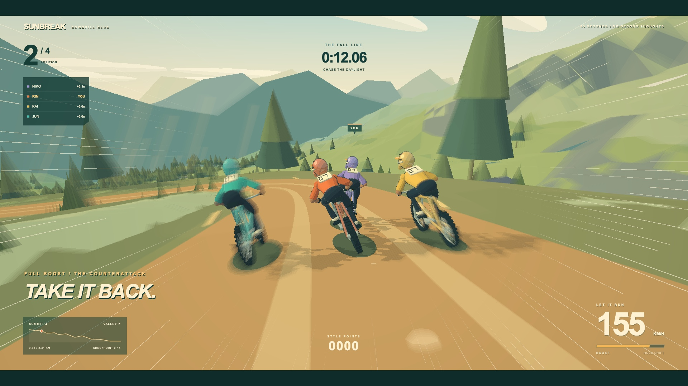

# SUNBREAK — Downhill Club

<p align="center">
  
</p>

<p align="center"><strong>Grab your handlebars, lean into the corners, and send it down the mountain!</strong></p>

**SUNBREAK** is a fast-paced 3D downhill mountain bike racing game you can play right in your web browser. Drop in against three fierce rivals, carve through hair-raising alpine berms, launch over massive canyon gaps, and throw down jaw-dropping air tricks—all the way to the checkered line!

---

## ⚡ Quick Start: How to Play

No downloads or heavy installs needed. Start the game with Node.js in seconds:

```sh
npm install
npm run dev
```

Open the link shown in your terminal (usually `http://localhost:5173`). Click anywhere or hit **Enter** to drop in at the starting gate!

---

## 🎮 Controls & Trick Guide

### Bike Controls

| Key | What it does | Pro Tip |
| :--- | :--- | :--- |
| **W** or **↑** | **Pedal / Accelerate** | Keep pedaling out of corners to build momentum! |
| **A** / **D** or **←** / **→** | **Steer** | Lean smoothly into turns or carve across the trail. |
| **S** or **↓** | **Brake / Slide** | Tap while turning to initiate a dirt-spraying drift. |
| **Space** *(Hold & Release)* | **Bunny Hop (Preload)** | Hold down as you approach a jump lip and release right at the edge for huge air! |
| **Shift** | **Nitro Boost** | Burns your boost gauge for blistering straightaway speed. |
| **C** | **Wheelie / Manual** | Pop your front wheel up to show off on flat sections. |
| **R** | **Quick Restart** | Instantly restart your race from the start gate. |
| **G** | **Ghost Rider** | Toggle your personal best ghost on or off. |
| **V** | **Weather Toggle** | Switch between golden morning sunshine and rainy alpine trails. |
| **F** | **Graphics Mode** | Toggle between full visual effects and lightweight performance mode. |
| **M** | **Mute / Unmute** | Toggle game audio and music. |
| **Esc** / **P** | **Pause Menu** | Pause the action and view controls. |

---

### Air Tricks (Score Big & Fill Your Boost!)

Whenever you catch air off a kicker, roller, or cliff drop, hit a trick key to perform a stunt. **Land straight to bank your style points and recharge your boost!** If you're still mid-trick when hitting the ground, you'll take a spill!

| Key | Trick Name | Style Points | How it looks |
| :---: | :--- | :---: | :--- |
| **1** | **Tabletop** | 180 pts | Tilt the bike flat and sideways in mid-air. |
| **2** or **X** | **X-Up** | 150 pts | Turn the handlebars a full 180° while keeping your grip. |
| **3** | **Superman** | 320 pts | Kick both legs straight back and fly horizontally behind the seat! |
| **4** | **Can-Can** | 280 pts | Kick both feet over the top tube to one side. |
| **5** or **N** | **No-Hander** | 340 pts | Let go of the handlebars and spread your arms wide! |
| **6** | **Nac-Nac** | 260 pts | Whip one leg behind the rear wheel with style. |
| **7** or **Space + D** | **Tailwhip** | 360 pts | Kick the bike frame in a full rotation around the handlebars. |
| **8** or **Space + A** | **360 Spin** | 420 pts | Spin yourself and your bike a full 360 degrees. |
| **9** or **B** or **Space + S** | **Backflip** | 500 pts | Pull backwards into a vertical backflip loop! |
| **0** or **Space + W** | **Frontflip** | 550 pts | Lean forward into a daring front roll! |

---

## 🚵 What Makes SUNBREAK Awesome?

### 1. Realistic Downhill Speeds
No cartoonish rocket speeds here! SUNBREAK features **real-world downhill mountain bike telemetry**:
- Flow through trail corners at a brisk **30–45 km/h**.
- Pick up speed down steep chutes and rock gardens at **50–70 km/h**.
- Hit full boost down the fastest straightaways to top out at **80–85 km/h**—just like the pros in real-world World Cup Downhill races!

### 2. Live Opponent Badges & Team Colors
Never lose track of your rivals! Every rider on the mountain has a **floating 3D name badge** hovering right above their helmet:
- **YOU** (Gold / #07): That's you, rider!
- **JUN** (Teal / #14): Disciplined, high-speed lines and butter-smooth cornering.
- **KAI** (Orange / #23): Aggressive overtaker who loves hitting kickers and throwing big tricks.
- **NIKO** (Violet / #42): Tactical racer who loves drafting behind you and making surprise passes.

Each badge shows their current name, live distance from you, and their official race number plate on their jersey.

### 3. Epic 360° Finish Line Celebration
When you cross the checkered arch, the race doesn't just stop cold:
- **Extended Trail**: The mountain track keeps rolling down the valley for another 150 meters past the finish line, giving you plenty of space to coast and celebrate!
- **Hands-in-the-Air Victory Pose**: Take 1st place and your rider will let go of the handlebars and throw both arms straight in the air in pure victory bliss—just like a world champion cyclist!
- **Podium Salute**: Finish 2nd, 3rd, or 4th to celebrate with a podium wave to the crowd.
- **360° Orbit Camera**: The camera smoothly swoops around your bike in a full 360-degree rotation.
- **Sleek Bottom Victory Banner**: A clean podium banner displays your rank (`P1 WINNER`, `P2 PODIUM`, etc.) without covering up your rider.

### 4. "Your Biggest Air" Cinematic Replay
A few moments after crossing the finish line, the screen gently dims and transitions into a **slow-motion cinematic replay** of your highest, sickest jump of the race! Watch yourself fly through the sky from a dramatic TV broadcast angle.

### 5. Rubbing is Racing: Collisions & Crashes
Watch your elbows! If you bump handlebars or sideswipe another rider at high speed, **both of you can wipe out**:
- Bikes and riders tumble realistically across the dirt.
- Riders don't clip through the ground—they slide naturally along the terrain, dust flying everywhere.
- Quick recovery lets you hop right back on your bike and chase down the pack!

---

## 🏔️ 5 Unique Mountain Tracks

Jump into **Single Race** mode to test your skills across five hand-crafted downhill tracks:

1. **The Sunbreak Descent**: Golden alpine morning light, sweeping cedar switchbacks, loose rock gardens, and a thrilling leap across a deep canyon ravine.
2. **Ridge Runner**: High-altitude slate cliffs, sheer granite drop-offs, sharp pine chicanes, and double rollers built for speed.
3. **Gravity Lab**: Slopestyle paradise under azure skies with manicured berms, step-downs, mega table-tops, and massive kickers.
4. **Red Dust Canyon**: Hot desert slickrock, terracotta canyon gaps, sandstone cliffs, and blinding red dirt drifts.
5. **Black Forest Slalom**: Twilight mist, slippery hemlock roots, tight chasm descents, and technical switchbacks that test your reflexes.

---

## 🏆 Championship Tour

Want to prove you're the undisputed downhill king? Jump into the **Championship Tour**:
- Race across all **5 stages** in a season-long Grand Prix campaign.
- Earn points each race based on where you finish:
  - **1st Place**: 25 points
  - **2nd Place**: 18 points
  - **3rd Place**: 15 points
  - **4th Place**: 12 points
- **Style Points Bonus**: Pull off big tricks during your race to earn bonus prize credits!
- Track the season leaderboard between rounds, stand atop the final awards podium, and lift the gold Championship Trophy!

---

## 🛠️ The Pro Shop & Bike Garage

Earn prize money from races and invest it in your ride at the **Pro Shop**:

### Performance Upgrades
- **Tires**: Enhances your cornering grip and keeps you glued to the dirt on loose gravel turns.
- **Suspension**: Softens rough rock gardens, soaks up big landings, and helps you recover faster from crashes.
- **Drivetrain**: Improves pedaling acceleration and cranks up your top downhill speed.
- **Springs**: Gives you a stronger bunny hop so you can launch higher off jump lips.

### Custom Paint Shop
Make your bike uniquely yours! Choose from:
- **8 Frame Colorways**: Electric Lime, Stealth Black, Desert Gold, Sunset Red, Deep Cyan, and more.
- **6 Jersey Styles**: Dress your rider in your favorite team colors.
- **6 Helmet Accents**: Match your helmet visor to your custom setup.

*All your garage upgrades and paint selections save automatically in your browser!*

---

## 💡 Pro Riding Tips

1. **Preload the Jumps**: Don't just ride off the lips—hold **Space** as you approach a jump and release it *just* as your front wheel reaches the lip. You'll fly twice as high!
2. **Drift Tight Corners**: On sharp switchbacks, tap **S** or **Down Arrow** while turning to slide the rear tire and swing your bike around without losing all your speed.
3. **Draft Your Opponents**: Ride closely behind an opponent to catch their slipstream and gain a speed boost to sling past them.
4. **Bank Your Tricks**: Always finish spinning or return your rider to the bars before hitting the ground. Clean landings give you instant boost!
5. **Upgrade Early**: If you're struggling to stay ahead in the Championship, spend your credits on **Tires** and **Drivetrain** first for instant speed and grip.

---

## 💻 Technical & Build Details

For developers, contributors, or anyone curious about what's under the hood:

- **Built with Pure Code**: Built in TypeScript with Three.js and WebGL2. Every piece of terrain, bike frame, rider skeleton, custom cel-shading shader, and sound effect is generated entirely in code with **zero downloaded 3D models or textures**.
- **Procedural Web Audio**: Synthesizes tire scree, wind hum, chain rattles, and custom dynamic music using browser Web Audio oscillators and noise filters.
- **Production Build**:
  ```sh
  npm run build    # Compiles TypeScript and builds Vite bundle
  npm run preview  # Previews production build locally
  ```
- **Automated Test Suite**:
  ```sh
  npm test         # Runs 22 comprehensive physics, rendering, and race systems tests
  ```

---

*Ready to ride? Drop in, tuck low, and see you at the bottom!*
